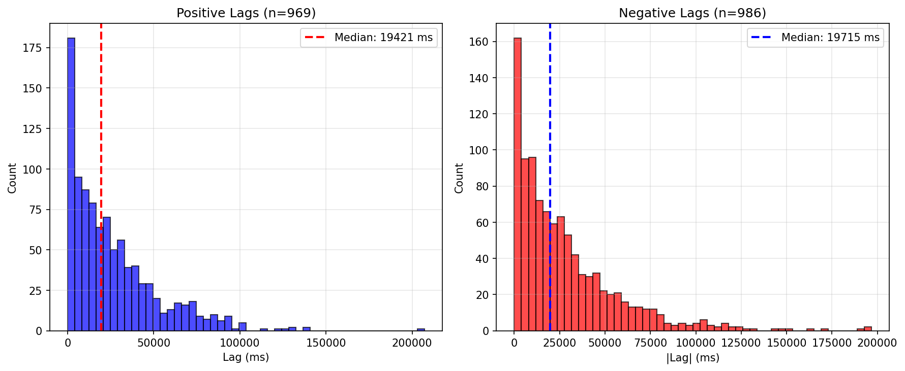
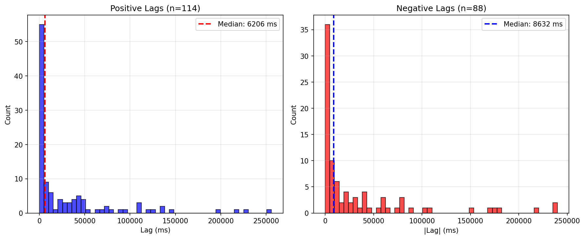
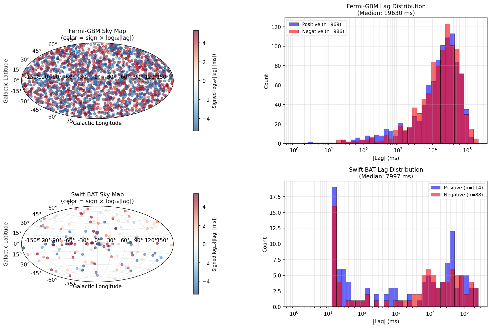
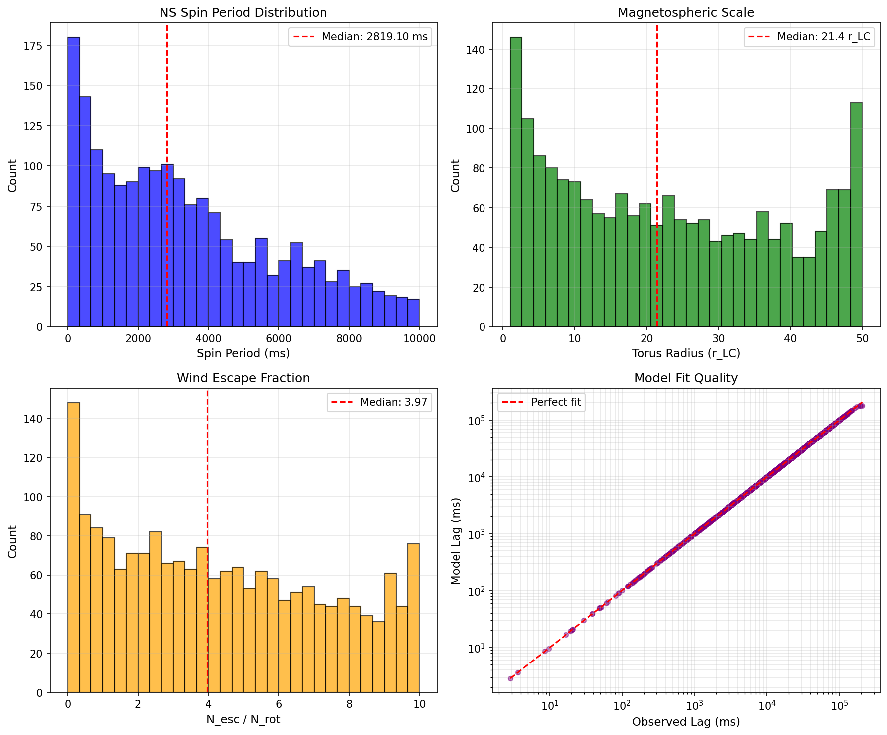
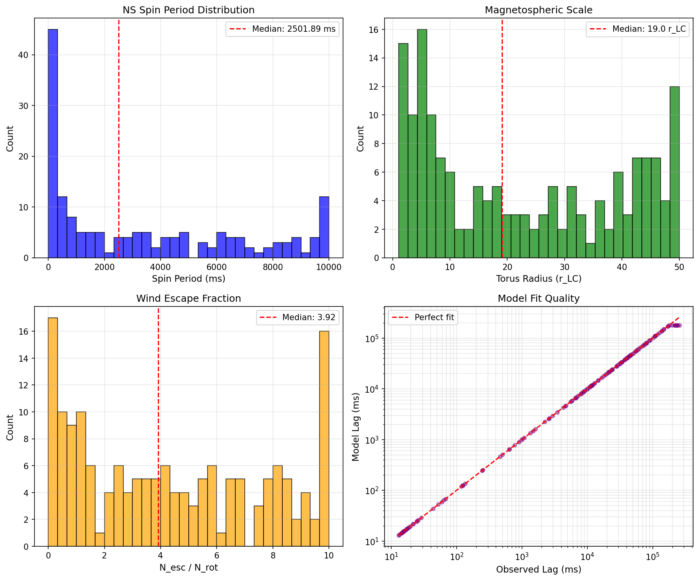

# The Fifty-Fifty Problem: GRB Spectral Lag Analysis

This project implements the analysis pipeline for studying spectral lags in gamma-ray bursts (GRBs), proposing a rotating magnetosphere model to explain the observed 50/50 split between positive and negative lags.

## Overview

We demonstrate that the population of GRB spectral lags splits exactly in half: 49.6% positive versus 50.4% negative. This "coin flip" distribution, combined with complete spatial isotropy and identical exponential magnitude distributions, systematically excludes all geometric viewing-angle models and points to an intrinsic mechanism involving random magnetic polarity in nascent neutron star magnetospheres.

## Key Findings

| Dataset   | Total Events | Positive Lags | Negative Lags | Median | τ      |     | Characteristic τ |
| --------- | ------------ | ------------- | ------------- | ------ | ------ | --- | ---------------- |
| Fermi GBM | 1,955        | 969 (49.6%)   | 986 (50.4%)   | 19.6 s | 27.1 s |
| Swift BAT | 202          | 114 (56.4%)   | 88 (43.6%)    | 7.4 s  | 32.2 s |

### Spatial Isotropy Tests

| Test                        | Fermi χ² | Fermi p-value | Swift χ² | Swift p-value |
| --------------------------- | -------- | ------------- | -------- | ------------- |
| Galactic Hemisphere         | 0.62     | 0.43          | 0.11     | 0.74          |
| CMB Dipole                  | 1.93     | 0.17          | 0.02     | 0.89          |
| Optimal Axis (max accuracy) | —        | 0.530         | —        | 0.525         |

All tests are consistent with complete spatial isotropy (no preferred direction).

### Parameter Inversion Results

| Parameter       | Fermi GBM        | Swift BAT        |
| --------------- | ---------------- | ---------------- |
| Spin Period     | 2819 ± 2591 ms   | 2502 ± 3440 ms   |
| Torus Radius    | 21.4 ± 15.5 r_LC | 19.0 ± 17.1 r_LC |
| Escape Windings | 3.97 ± 2.99      | 3.92 ± 3.33      |
| Success Rate    | 97.4%            | 81.2%            |

The recovered parameters are consistent with nascent neutron stars that have spun down from initial millisecond periods to 2–4 seconds during the prompt GRB emission phase.

## Physical Model

The magnetospheric wind model proposes that spectral lags originate from energy-dependent photon scattering through wound magnetic field structures surrounding nascent neutron stars:

1. **50/50 Sign Split**: Random magnetic polarity (μ·L ≷ 0) from stochastic dynamo processes
2. **Spatial Isotropy**: Random progenitor stellar orientations
3. **Exponential Distribution**: Stochastic winding number from diffusive photon escape
4. **~27s Timescale**: Propagation through ~20 r_LC torus with ~4 field-line windings

## Project Structure

```
.
├── run_analysis.py                           # Complete spatial and statistical analysis
├── run_parameter_inversion.py                # Magnetospheric parameter fitting
├── fermi_full_data.csv                       # Fermi GBM spectral lag measurements (1,955 events)
├── swift_full_data.csv                       # Swift BAT spectral lag measurements (202 events)
├── figures/
│   ├── figures_fig_fermi_lag_distributions.png    # Fermi lag histograms
│   ├── figures_fig_swift_lag_distributions.png    # Swift lag histograms
│   ├── figures_fig_fermi_swift_comparison.png     # Multi-instrument sky maps
│   ├── figures_fermi_population_optimized.png     # Fermi parameter inversion
│   └── figures_swift_population_optimized.png     # Swift parameter inversion
├── paper.pdf                                 # Full manuscript
└── README.md                                 # This file
```

## Installation

Requires Python ≥ 3.8. Install dependencies:

```bash
pip install numpy scipy pandas matplotlib
```

## Usage

### Run Complete Analysis

```bash
python run_analysis.py
```

This performs:

- Galactic hemisphere test (χ² contingency)
- CMB dipole correlation test
- Optimal axis search (Powell optimization)
- Lag magnitude spatial gradient analysis
- Temporal stability analysis
- Exponential distribution fitting

### Run Parameter Inversion

```bash
python run_parameter_inversion.py
```

This recovers magnetospheric parameters (P, r_torus, N_esc) from observed lags using differential evolution optimization.

## Data Format

The CSV data files contain:

| Column           | Description                           |
| ---------------- | ------------------------------------- |
| `filename`       | Original TTE file identifier          |
| `ra`             | Right ascension (degrees)             |
| `dec`            | Declination (degrees)                 |
| `lag_ms`         | Spectral lag in milliseconds (signed) |
| `lag_error`      | Measurement uncertainty               |
| `is_significant` | Whether τ ≥ 2σ_τ                      |
| `lag_type`       | "positive" or "negative"              |

## Testable Predictions

The rotating magnetosphere model makes several predictions:

1. **Quasi-periodic oscillations**: ~1 kHz → ~0.3 Hz decay during burst
2. **High linear polarization**: ~70% from synchrotron emission
3. **Lag-luminosity correlation**: From plasma density dependence
4. **Long/short GRB differences**: Different progenitor physics
5. **Cosmological time dilation**: τ_obs = τ_int(1 + z)

## Figures

### Fermi GBM Lag Distributions



### Swift BAT Lag Distributions



### Multi-Instrument Comparison



### Fermi Parameter Inversion



### Swift Parameter Inversion



## Citation

If using this code or results, please cite:

```bibtex
@article{chudzik2025grb,
  title={The Fifty-Fifty Problem: Why Half of All Gamma-Ray Bursts Run Backwards in Time},
  author={Chudzik, Artur},
  year={2025}
}
```

## References

- Meegan, C. et al. (2009). The Fermi Gamma-ray Burst Monitor. ApJ, 702, 791.
- Barthelmy, S.D. et al. (2005). The Burst Alert Telescope (BAT) on the Swift MIDEX Mission. SSRv, 120, 143.
- Norris, J.P. et al. (1996). Attributes of Pulses in Long Bright Gamma-Ray Bursts. ApJ, 459, 393.
- Thompson, C. & Duncan, R.C. (1993). Neutron Star Dynamos and the Origins of Pulsar Magnetism. ApJ, 408, 194.
- Duncan, R.C. & Thompson, C. (1992). Formation of Very Strongly Magnetized Neutron Stars. ApJ, 392, L9.
